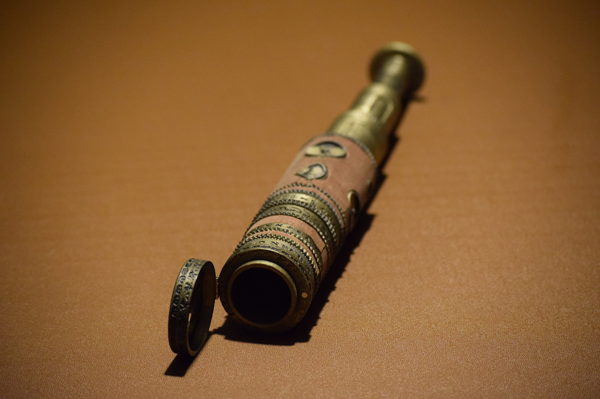
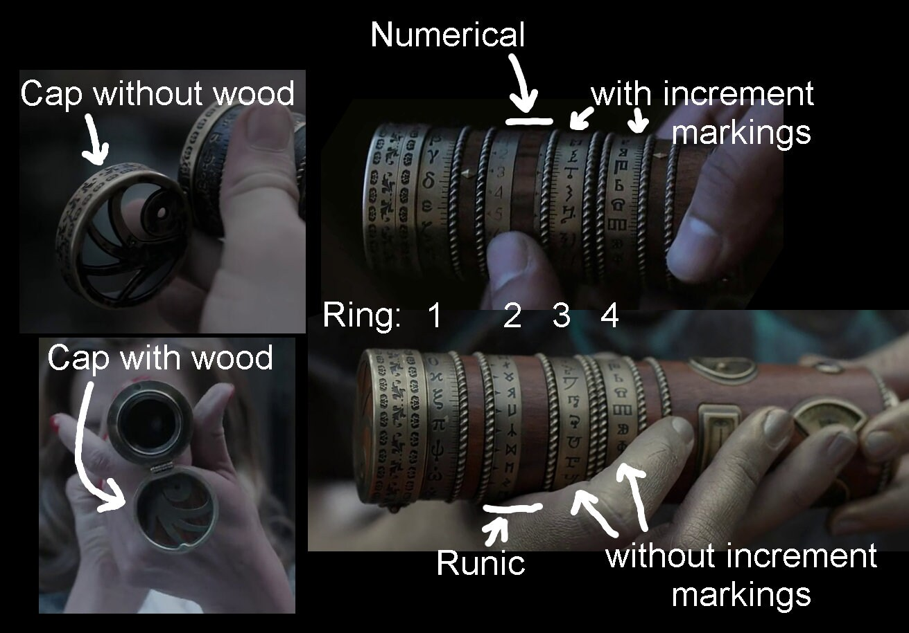

# A Series of Unfortunate Events Spyglass

In 2019 I designed, manufactured and sold some replica spyglasses from the Netflix show A Series of Unfortunate Events.

I sold these through Etsy along with the digital 3D models for users to print at home.

I stopped selling the physical version and eventually stopped renewing the digital version.

For data preservation reasons I have decided to upload everything here so that anyone can download and print the spyglass without me having to update anything.

If you find this useful please consider sending me some money. This can be done through the [Github sponsor program](https://github.com/sponsors/gentlegiantJGC) or [Paypal]( https://www.paypal.me/gentlegiantJGC).

## Animation

Here is an animation of the parts that move and the ring and cap variants.

https://sketchfab.com/models/5cf3c515d66244469c41cf9eb4dcae78

## Additional Materials

- 3D Printer - I will assume you are using an FDM printer.
- Filament - I suggest getting a metallic gold filament.
- Gold spray paint - Optional to make the parts look better.
- Small hinge - about 8mm by 10mm
- 4 Screws to hold the hinge in place - I used M1.6 x 4mm machine screws
- 2 cylinder magnets - 3mm diameter 4mm long
- Veneer - I used mahogany

## Pre-processing

I suggest first doing some test prints to make sure the parts fit together correctly.

I designed the parts to fit correctly for my setup but your printer or slicer settings may vary meaning the parts don't fit together or have to much clearance.

You can load the STL models into a 3D modeling program like blender and tweak the dimensions.

## Parts

When referring to the spyglass I always have the VFD lens cap on the left and the extending telescope on the right. In this orientation all the symbols should be the correct way up (note in some shots the rings are on the wrong way around so they are upside down and in some shots the footage has been mirrored)

The spyglass comes in two halves. The left is referred to as the head and the right as the tail.

All the parts for the head half can be found in the folder called "head" and the parts for the tail can be found in the folder called "tail". The only excpetion is ringGrip.STL which is used by both halves and is stored in "common"

There are a couple of variants of the spyglass throughout the show.

The image below labels the major differences.

Pick the variant of each part that you want.

Parts listed from left to right:

### Head

- cap
  - ./head/cap/cap.STL				(Used in burnt spyglasses)
  - ./head/cap/capWithWood.STL		(Used in unburnt spyglasses)
- head body: ./head/headBody.STL
- ring 1: ./head/ring1/greekRing.STL
- wood and grip: ./head/wood&Grip.STL
- ring 2:
  - ./head/ring2/numerical.STL		(Used in Monty's spyglass, title screen and Incomplete History of Secret Organisations)
  - ./head/ring2/Runes.STL			(Used in Baudelaire's, Lemony Sniket's, Jacquelyn's, Olivia's)
- ring grip: ./common/ringGrip.STL
- ring 3:
  - ./head/ring3/magiRingBlank.STL				(Used in Baudelaire's, Lemony Sniket's, Jacquelyn's, Olivia's )
  - ./head/ring3/magiRingIncrements.STL			(Used in Monty's spyglass and Incomplete History of Secret Organisations)
- ring grip: ./common/ringGrip.STL

### Tail (Read to futher down before assembling this part)
- ring grip: ./common/ringGrip.STL
- ring 4:
  - ./tail/ring4/angular_glagolitic_ring.STL				(Used in Baudelaire's, Lemony Sniket's, Jacquelyn's, Olivia's )
  - ./tail/ring4/angular_glagolitic_ring_increments.STL		(Used in Monty's spyglass and Incomplete History of Secret Organisations)
- screw thread: ./tail/tail_screw_thread.STL
- tail body: ./tail/tail_body.STL
- ruby: ./tail/ruby.STL					(I am not 100% sure this is supposed to be a ruby. There are not any good shots of it.)
	
- telescope large: ./tail/telescope/telescopeLarge.STL
- telescope medium: ./tail/telescope/telescopeMedium.STL
- telescope small part 2: ./tail/telescope/telescopeSmall_part2.STL
- telescope ring 1: ./tail/telescope/telescope_ring1.STL
- telescope ring 2: ./tail/telescope/telescope_ring2.STL
- telescope ring 3: ./tail/telescope/telescope_ring3.STL
- telescope small part 1: ./tail/telescope/telescopeSmall_part1.STL
	
## Painting

Once printed I suggest painting the parts individually with a gold spray paint to make them look more metallic.

If you want a weathered look, water down some black paint and do a heavy wash across the whole part then with a cloth wipe away the excess. This will leave the paint stuck in the grooves where dirt would get stuck.

Play around with the amount of water you add the paint to get the look you want.

## Veneer

The veneer is rather tricky to do.

`tail/veneer.stl` is a template that can be printed and used to cut out the veneer for the tail section to fit around the dials.

The other parts are rectangular sections that can be cut out with a ruler.

Once cut they can be glued onto the printed parts.

## Assembling

I uploaded a 3D animation of how the parts fit together and move on Sketchfab.

You can drag the animation to change the viewing angle, mouse wheel or zoom gesture to zoom and use the playback controls at the bottom like you would with a video.

https://sketchfab.com/models/185d379b8a7848b7ba2333440abb0364

Most of the parts can be assembed in the order they are listed in the parts section above. The exception is the tail.

Follow the steps below or use the animation above to assemble the tail.

1) Insert "telescope large" into "tail body" from the left
2) Insert "telescope medium" into "telescope large" from the left
3) Thread telescope rings 1-3 onto "telescope small part 1" from the left (check the order)
4) Thread telescope small part 1 plus the three rings through "telescope medium" from the right
5) Press "telescope small part 2" onto the end of "telescope small part 1" from the left (this may be very difficult)
6) Press "screw thread" into the left of "tail body" locking the whole telescope assembly in place
